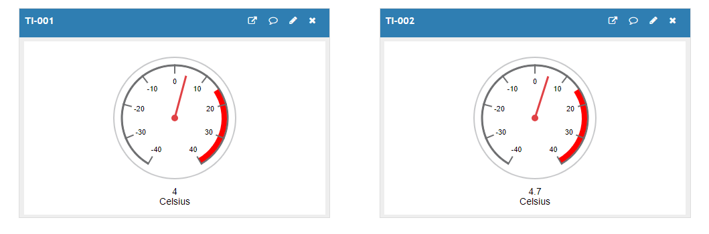
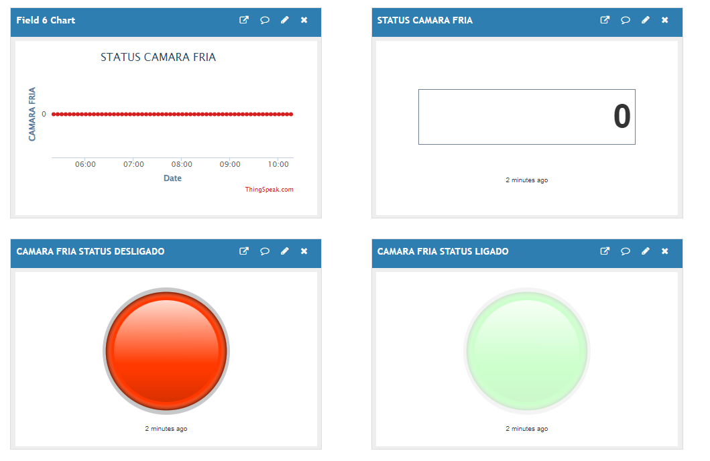

# Cervejaria_Half_Mouth_IoT_Project

Monitoramento Remoto da Cervejaria HalfMouth.

## - Objetivo

Realizar o monitoramento remoto da temperatura dos fermentadores e da camara fria utilizados no processo de produção de cerveja, assim como, acompanhar o status de funcionamento do chiller, principal equipamento responsável pelo resfriamento dos fermentadores e status de funcionamento da camara fria.

## - Protótipo

São utilizados no protótipo IoT as seguintes peças: 
 - Controlador ESP32;
 - Controlador TCALL ESP32 SIM800L;
 - Display TFT 3.5"; 
 - Sensores do tipo NTC;
 - Módulo DS3231(responsável pela data e hora);
 - SD Card 16Gb;

### Painel Responsável tela leitura das temperaturas:

### Controlador TCALL responsável pelo envio dos dados:

## - Comunicação

Devido a localização do chiller e dos fermentadores estarem a uma considerável distância, e inviabilizando a passagens de cabos para receber o status de parametros do chiller, considerou-se a opção de comunicação usando ESP-NOW entre os controladores ESP32 e o TCALL ESP32 SIM800L.
O ESP-NOW é uma rede de alta velocidade, desenvolvido pela Espressif que permite que vários dispositivos se comuniquem sem utilizar uma rede WiFi feita por um roteador.
O Controlador ESP32 envia os dados das temperaturas ao controlador TCALL através da comunicação ESP-NOW. Para os dados serem enviados ao Server ThingSpeak, é utilizado o controlador TCALL que por meio da rede GSM, envia os dados ao ThingSpeak utilizando protocolo MQTT.
A comunicação é feita conforme mostra a imagem abaixo:

### Comunicação do Protótipo:

## - Resultados

A Internet das Coisas (em inglês: *Internet of Things*, IoT) descreve a rede de “objetos físicos” incorporados a sensores, software e outras tecnologias com o objetivo de conectar e trocar dados com outros dispositivos e sistemas pela internet. 
Através da integração com a plataforma ThingSpeak, é possível monitorar a temperatura, funcionamento da bomba de recirculação, do chiller e da camara fria através de celulares utilzando o aplicativo ThingViewer, ou acessando diretamente a página web do servidor com login e senha respectivamente.
Os dados são enviados a cada 5min ao ThingSpeak, foi implementado adicionalmente no programa para que os dados sejam também gravados localmente no cartão de memória.

### Monitoramento da Temperatura:

### Monitoramento do Funcionamento da Bomba de Recirculação:

### Monitoramento do Funcionamento da Camara Fria:

### Monitoramento do Funcionamento do Chiller:
